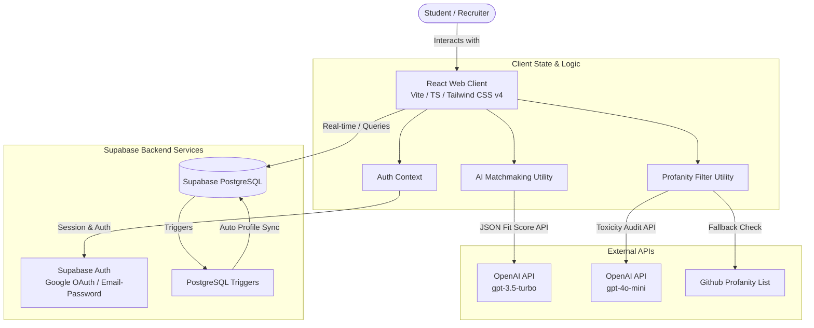
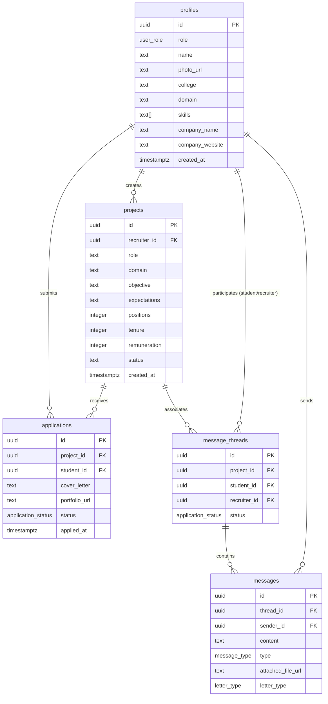

# Project Match Platform: Design Overview

This document provides a comprehensive technical overview of the **Project Match** platform, a web-based ecosystem that connects students with recruiters (companies, startups, and professors) for project-based opportunities.

---

## 1. High-Level Architecture

The Project Match platform utilizes a modern decoupled architecture consisting of a React frontend client and a serverless backend powered by Supabase and OpenAI.



---

## 2. Frontend Architecture & Refactored Design System

The frontend is built using **React**, **TypeScript**, and **Vite** with styling handled by **Tailwind CSS v4**.

### 2.1 Technologies & Routing
- **Entry Points:** The application is bootstrapped in [src/main.tsx](file:///Users/shinjanpatra/Downloads/projectMatch/src/main.tsx) and routed in [src/App.tsx](file:///Users/shinjanpatra/Downloads/projectMatch/src/App.tsx).
- **Client Routing:** Page routing is handled client-side using `react-router-dom` with role-based routing guards:
  - `ProtectedStudentRoute` checks if the student is authenticated and has finished onboarding ([src/pages/StudentProfileForm.tsx](file:///Users/shinjanpatra/Downloads/projectMatch/src/pages/StudentProfileForm.tsx)) before granting dashboard access.
- **Global Context:** [src/contexts/AuthContext.tsx](file:///Users/shinjanpatra/Downloads/projectMatch/src/contexts/AuthContext.tsx) synchronizes the authentication state from Supabase, updates local caching, and manages user role resolution.

### 2.2 Refactored Visual Design System (Target Guidelines)
To maximize credibility and task efficiency, the visual design focuses on **Opportunity, Evaluation, and Collaboration** rather than decorative futuristic tech-startup elements:

- **Typography:**
  - **Primary & Headings Font:** Transitioning to a neutral professional sans-serif (e.g., standard system sans-serif or clean interface typography like `Inter` / `Space Grotesk` clean weights) to establish a highly credible, clear visual hierarchy.
  - *Chakra Petch* is removed from structural headers to eliminate startup aesthetic bias and enhance reading confidence for recruiters and academic partners.
- **Color & Contrast:**
  - Solid, clean surfaces are used as layout defaults (light gray backgrounds for productivity-heavy workflows, dark gray options without background mesh blobs/gradients).
  - Brand colors are separate from functional states. Semantic colors are reserved exclusively for critical status markers (Green for Hired/Completed, Yellow for Pending, Red for Action Required).
- **Surface Architecture (Eliminating Structural Glassmorphism):**
  - High backdrop blurs and translucent borders are removed from layout wrappers and primary dashboard surfaces.
  - Layout containers use solid panels with clean, minimal borders. Glassmorphism is reserved strictly for temporary floating layers (modals, dropdown menus, and messaging drawers).
- **Motion & Interaction System:**
  - Micro-animations are limited to functional utility states (explicit form validation checks, page transitions, and status updates).
  - Decorative sweep shines, button scaling, and rotating gradients are disabled to prevent visual clutter and reduce cognitive load during candidate comparison.

---

## 3. Database Architecture & Models

The system runs on **Supabase (PostgreSQL)**. All table structures, relationships, and permissions are defined in [supabase_schema.sql](file:///Users/shinjanpatra/Downloads/projectMatch/supabase_schema.sql) and [supabase_trigger.sql](file:///Users/shinjanpatra/Downloads/projectMatch/supabase_trigger.sql).

### 3.1 Data Schema ERD



### 3.2 Automated Triggers
A PL/pgSQL trigger ([supabase_trigger.sql](file:///Users/shinjanpatra/Downloads/projectMatch/supabase_trigger.sql)) automates registration side-effects. When a user registers through Supabase Auth, `public.handle_new_user()` auto-populates their record in the `profiles` table by extracting attributes (like display name, avatar, role, and company details) directly from metadata.

### 3.3 Security: Row Level Security (RLS)
The database enforces strict isolated reading/writing constraints:
- **Profiles:** Publicly readable by anyone; modifications restricted to the profile owner.
- **Projects:** Readable by everyone; insertions and edits restricted to the creator (recruiter).
- **Applications:** Students can view/create their own applications. Recruiters can view and update application statuses *only* for projects they own.
- **Messaging:** Messages and threads are only viewable by the specific student and recruiter registered to that thread.

---

## 4. Key Workflows & Features

### 4.1 Candidate Application & Application Pipeline
Students submit applications stating their availability and attaching cover letters. The interaction lifecycle progress is visualized in the pipeline below:

```mermaid
sequenceDiagram
    autonumber
    actor Student
    actor Recruiter
    participant Supa as Supabase Database
    participant AI as OpenAI API

    Student->>Supa: Submit Application with Cover Letter
    Note over Student, Supa: Cover Letter is audited for profanity
    Supa-->>Recruiter: Application Appears in Pipeline
    Recruiter->>AI: Trigger calculateMatchScore()
    Note over AI: Analyzes Student Profile vs. Project Expectations
    AI-->>Recruiter: Returns Match Score (0-100) & Feedback
    Recruiter->>Supa: Update Application Status to "Accepted"
    Supa->>Supa: Auto-Create Message Thread for Chat
    Supa-->>Student: Dashboard updates; chat channel opens
```

### 4.2 Utility Layer: AI Matchmaker
The match score computation in [src/utils/aiMatch.ts](file:///Users/shinjanpatra/Downloads/projectMatch/src/utils/aiMatch.ts) utilizes the OpenAI API. It sends the project details (role, expectations, domain) and the candidate details (profile background, application cover letter) to `gpt-3.5-turbo`. It returns a structured JSON payload containing:
1. A matching score (percentage fit).
2. Bulleted feedback on how the applicant can improve their pitch for the specific role.

*Redesign Guideline:* The UI avoids presenting the AI score as a flashy decorative gauge. AI is presented as an **explanation layer** containing the score alongside written context (strengths, concerns, and evidence) to keep recruiters grounded in objective applicant profiles.

### 4.3 Content Moderation
To ensure clean and constructive communication, [src/utils/profanityFilter.ts](file:///Users/shinjanpatra/Downloads/projectMatch/src/utils/profanityFilter.ts) audits user-provided text inputs (e.g., project descriptions, cover letters, profile setup fields). 
- **Primary Engine:** Queries OpenAI's `gpt-4o-mini` with strict system instructions to flag toxicity or explicit slurs.
- **Local Fallback Engine:** If API quotas are exceeded or network connectivity fails, a local pipeline downloads a fallback blacklist from a GitHub CDN or uses a local cache of regex matchers to ensure content moderation remains active.

### 4.4 Messaging System & Document Issuance
- **Real-Time Messaging:** [src/components/recruiter/MessagingHub.tsx](file:///Users/shinjanpatra/Downloads/projectMatch/src/components/recruiter/MessagingHub.tsx) and [src/components/student/StudentMessagingHub.tsx](file:///Users/shinjanpatra/Downloads/projectMatch/src/components/student/StudentMessagingHub.tsx) establish real-time PostgreSQL subscriptions to the `messages` table for instant communication.
- **Document Generation:** Recruiters can dispatch official documents (like **Joining Letters** and **Completion Certificates**) directly in the chat thread. These documents generate custom system-typed records linked with attachment links, which display formatted download links inside the student's dashboard and communication log.
