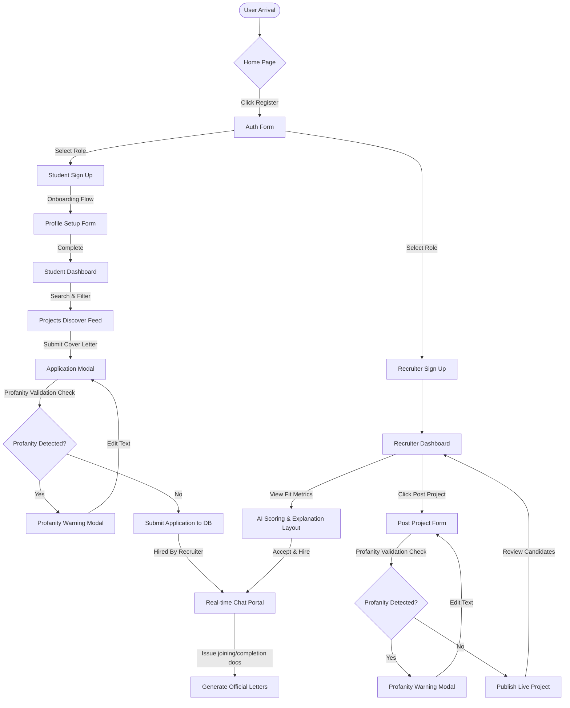

# Project Match Platform: UI/UX Design Overview

This document outlines the UI/UX design system of the **Project Match** platform, detailing its core layouts, user flows, and refactored styling guidelines designed to prioritize task efficiency, credibility, and clarity.

---

## 1. Visual Identity & Brand System (Refactored)

The platform is designed around the core jobs-to-be-done: **Opportunity, Evaluation, and Collaboration**. All visual elements are structured to convey professional trust rather than generic "futuristic tech-startup" aesthetics.

### 1.1 Color & Surface Architecture
- **Workspace Surface Defaults:** Long-duration workspaces (such as reading applications, writing project briefs, and reviewing candidate matches) utilize clean, solid backgrounds (neutral off-whites in light mode and deep slates in dark mode). Ambient mesh gradients and floating blurred blobs are removed to eliminate visual fatigue.
- **Surface Layering:** Structural layout containers (main dashboard panels, content tables, feeds) use solid backgrounds with thin, flat borders. Glassmorphism is removed from structural layers and reserved strictly for transient overlays (modals, dropdown sheets, and utility sliders).
- **Functional Semantics:** Colors are reserved strictly for semantic state indicators:
  - **Green:** Accepted, Hired, or Completed states.
  - **Yellow:** Pending review or awaiting input.
  - **Red:** Action required, deadline approaching, or rejected status.
  - Decorative gradient text is replaced with clean solid colors to maintain a clear information hierarchy.

### 1.2 Typography
- **Core Font Stack:** The system uses a neutral, professional sans-serif typeface (e.g. system standard UI fonts or clean weights of standard interfaces) for headings, body text, and statistics.
- **Clarity Over Styling:** Structural headings use weighted sans-serifs rather than angular fonts (like *Chakra Petch*) to maintain professional credibility for recruiters, academic researchers, and students.

### 1.3 Interaction & Animation System
- **Animation with Purpose:** Decorative micro-animations (such as sweeping shines, constant hover translations, and rotating conic borders) are removed.
- **Functional Motion Rules:** Motion is restricted to three distinct purposes:
  1. **Navigation:** Transitioning between pages and drawers.
  2. **Feedback:** Acknowledging status updates or successful actions.
  3. **State Change:** Indicating loading progress or toggle states.

---

## 2. Core Layouts & Job-Specific Grammars

To optimize the workspace for different target profiles, the platform implements distinct visual densities tailored to specific user tasks.

### 2.1 Landing Page (Product-Native Feed)
- **Concept:** Replaces generic startup elements (badge indicators, static statistics cards, and infinite marquees) with a product-native workflow layout.
- **Structure:** Displays a structured interactive preview showing a sample project path: posting a role, generating match results, opening real-time chat, and generating certificates.
- **Credibility Area:** Replaces decorative marquees with a static list of participating departments, organizations, and verified projects.

### 2.2 Calm Onboarding & Utility Auth
- **Structure:** Auth interfaces ([src/pages/Login.tsx](file:///Users/shinjanpatra/Downloads/projectMatch/src/pages/Login.tsx)) are designed as simple, clean forms with clear input lines.
- **Onboarding Forms:** [src/pages/StudentProfileForm.tsx](file:///Users/shinjanpatra/Downloads/projectMatch/src/pages/StudentProfileForm.tsx) uses a clean step-by-step wizard format to help users enter education, skills, and links without decorative visual effects.

### 2.3 Recruiter Pipeline: Data-Oriented Candidate Evaluation
- **Visual Design:** Grid-based cards are replaced with a dense candidate comparison table/matrix. Recruiters can view all applicants in a clean list format to scan skills, colleges, and availability.
- **Evaluation Details:** Selecting a row slides open a structured detail pane that shows the applicant's profile and matching context.
- **AI Score Context:** Rather than displaying decorative colored AI match wheels, AI feedback is integrated as an explanation layer:
  - **Match Score:** A clean numerical indicator.
  - **Evidence:** Profile matches and skill alignments.
  - **Strengths & Concerns:** Key evaluation takeaways for the recruiter.

### 2.4 Student Workspace (Discovery & Feed)
- **Search & Filter:** [src/pages/Projects.tsx](file:///Users/shinjanpatra/Downloads/projectMatch/src/pages/Projects.tsx) displays search results in clean list rows. Filters (duration, stipend, domain) are arranged in a persistent left-hand sidebar for rapid adjustments.
- **Onboarding Portfolio:** Replaces glowing badges with a clean project archive case-study layout that lists roles, deliverables, outcomes, and earned stipends.

---

## 3. UI/UX Interaction Flows

The diagram below details the user flows and safety validations configured for the platform's key tasks:

